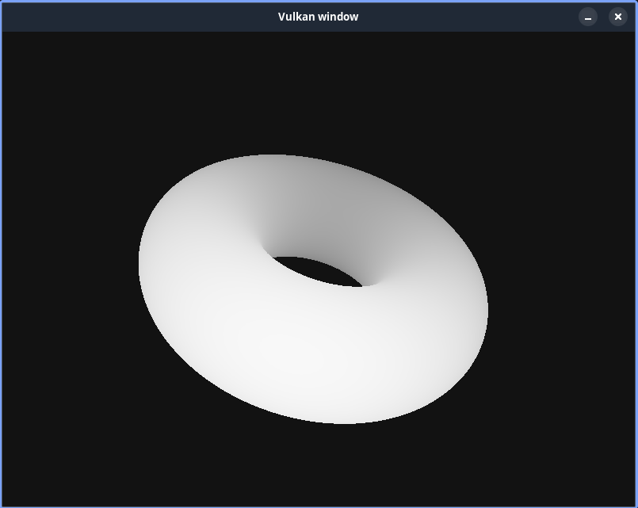

# JVR (Jaipal's Vulkan Renderer)

## Compiling

```sh
make build/jvr.so  -j8
make build/jvrc.so -j8
```

## Running

```sh
make test  MAIN=src.cpp SHADER=prefix # prefix.frag and prefix.vert will be picked
make testc MAIN=src.c   SHADER=prefix # prefix.frag and prefix.vert will be picked
```


## Example

```sh
make test MAIN=donut.cpp SHADER=donut # Spinning donut or
make test MAIN=triangle.cpp SHADER=triangle # triangle
```


## Donut Example Demo



> [!WARNING]
> Please do not use C Vulkan Render, but if you do, Just Why?
